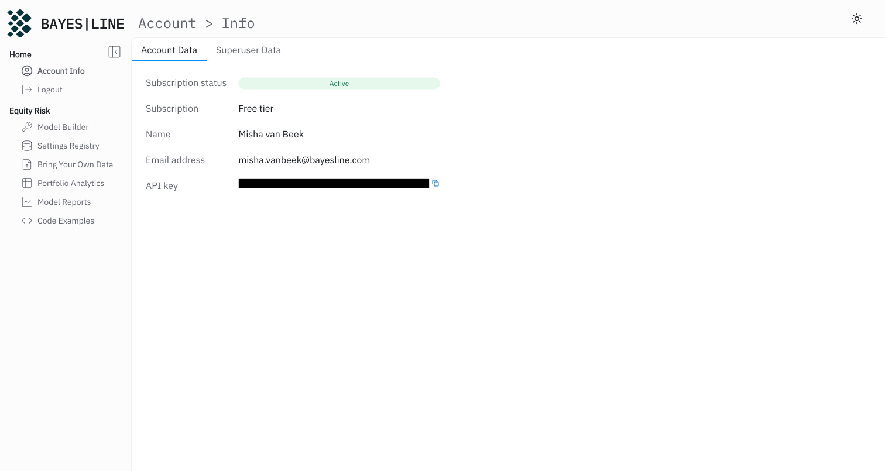
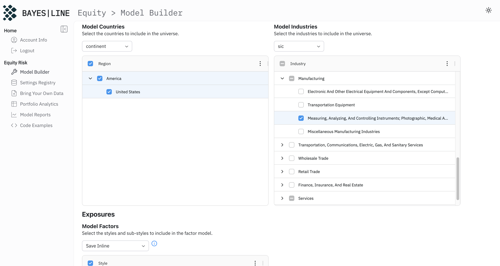
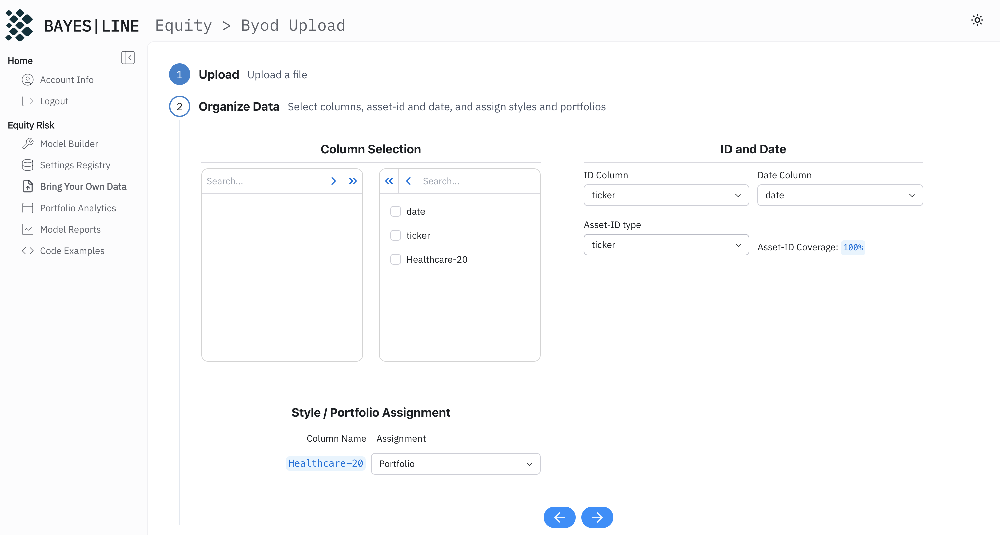
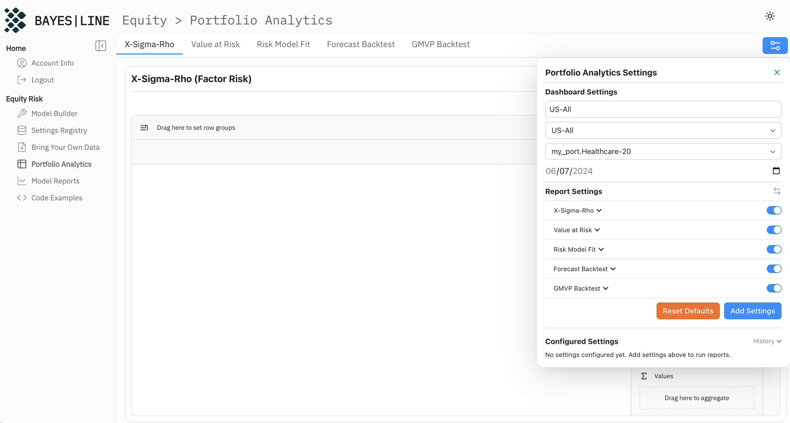
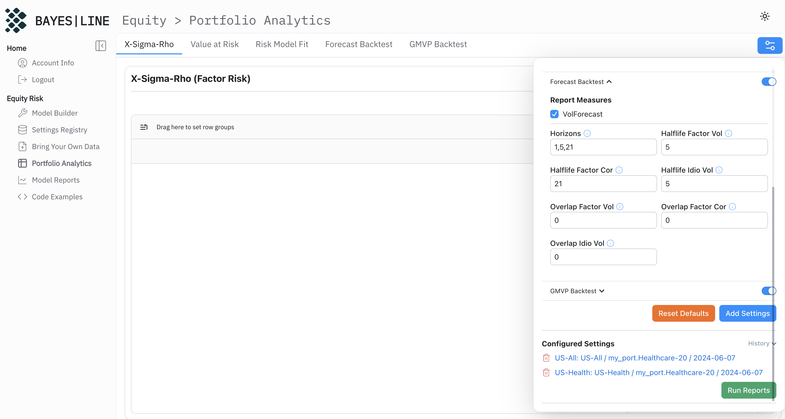
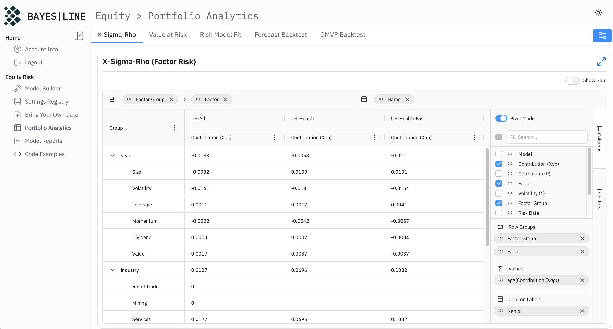
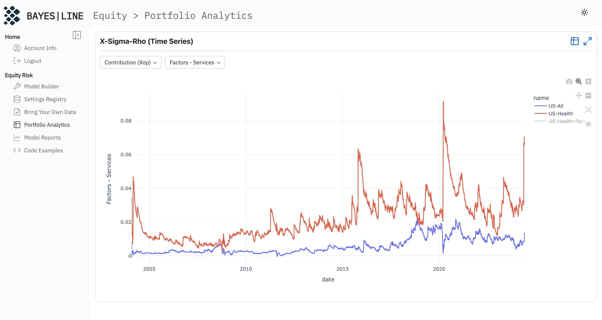
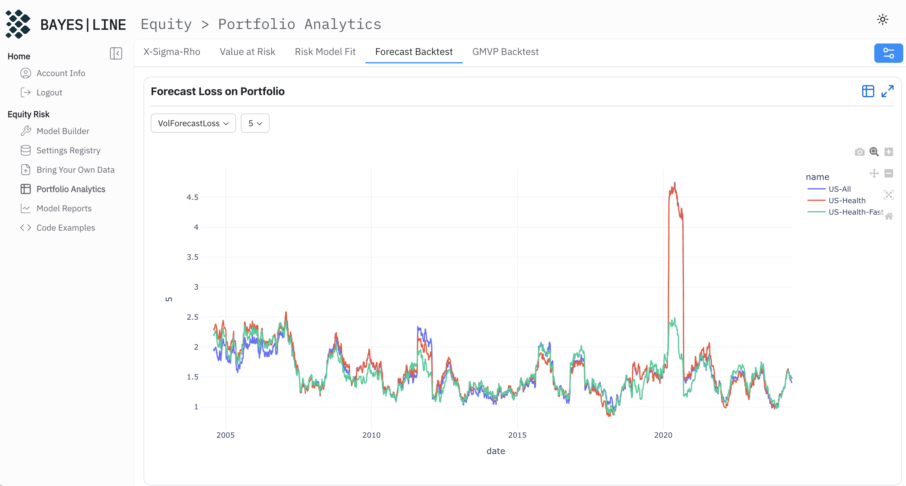

import { Img } from '@/components';

# Building a factor model with the Bayesline Risk Suite

## Getting started

If you have not created an account yet, now is the time. You will only need a valid email address to [register](https://app.bayesline.com/signup). After following the steps, you can log in and check your account information. It should look something like this.

## Creating a model

Using the sidebar menu to navigate to the `Settings Registry`, you will see under the `Risk Models` tab that there is a "US-All" model present. This is the default model that we calibrated for you, and it includes all industry factors.

Next, head to the `Model Builder` on the left. We will create a healthcare-specific model that is tailored to our healthcare portfolio. Give the model a name by typing "US-Health" under `Model Meta Data`. Select all countries, all styles, and under industries select only "Manufacturing - Measuring, Analyzing, And Controlling Instruments, Photographic, Medical And Optical Goods; Watches And Clocks", and "Services - Health Services".

<aside>
  We are working with the open-source SIC codes here for demonstration purposes. In a more realistic setting you will
  want to use a different hierarchy. For different hierarchies, please [schedule](http://schedule30.bayesline.com) a
  30-minutes slot with us.
</aside>

After saving the model at the bottom of the page, you can find the US-Health model under `Settings Registry`.

# Uploading a portfolio

Uploading any data is intuitive through our `Bring Your Own Data` tab. Just drag and drop a file into the uploader with portfolio holdings. For this particular exercise, download the healthcare portfolio [here](https://app.bayesline.com/portfolio-healthcare-top20-equal-weight.csv). After dragging the file into the downloader, select `Portfolio` at the bottom, as shown in the screenshot below, and hit next. You are asked to give this data a name, type "my_port".

<aside>
  Bringing in internal or vendor data in bulk is easier with a scheduled job. Please
  [schedule](http://schedule30.bayesline.com) a 30-minutes slot with us for more information.
</aside>

# Portfolio analysis

Now that we have a portfolio as well as two risk models, we will create some alternative settings using these models. Navigate to the `Portfolio Analytics` tab. At the top left, click the blue settings menu. This menu is used to create the settings necessary to run all reports under the various settings at the top.

In the example above under dashboard settings we have (1) typed the name of the settings, "US-All", then (2) selected the US-All model, as well as (3) the uploaded portfolio. By clicking `Add Settings` these specific settings are added and listed at the bottom.

Name the second settings "US-Health", and change the risk model to "US-Health". Then also add these settings. For the third settings (see below) we are going to change some of the lower-level forecasting settings in some of the reports. Name these settings "US-Health-Fast", open the `X-Sigma-Rho` group under `Report Settings`, and shorten the volatility-related halflifes to 5 days, and the correlation one to 21 days. Do the same for `Forecast Backtest`, as shown below. Then again click `Add Settings`, and finally `Run Reports`. All reports are now being generated.

After a few seconds, the X-Sigma-Rho report should become visible. All reports share some common features:

1. A tabular form is always available, for most report a graphical representation is too. If a graphical version is available, the toggle in the top left can be used to switch back and forth.
2. The top left of the report can be used to enable full-screen viewing.
3. The first column is a tree-hierarchy that represents the grouping. The hierarchy levels are displayed at the top.
4. The columns side-panel controls which columns are shown, as well as grouping an pivoting.

The X-Sigma-Rho report is the bread and butter of risk decomposition. It includes four columns, Exposure ($X$), Volatility ($\sigma$), Correlation ($\rho$), and Contribution ($X\sigma\rho$). The different models are stacked vertically by default, which for this portfolio in particular does not make the most sense. We would like to see things side by side for the three models. We can achieve this by entering `Pivot Mode` on the side. This initially gives us 12 columns. If we are only interested in comparing the contribution, we can deselect the other columns in the side menu to get to the comparison below.

There is an especially large gap between the risk contributions of the Services industry factor. This can be explained by the fact that our newly created services factor better aligns with the portfolio we are using. Scrolling down to the specific risk report, we see that the US-Health model serves a smaller total contribution from specific risk, as expected from a more tailored model.

The report at the bottom of the page is the time-series X-Sigma-Rho report. Effectively it takes every cell of the standard report and turns it into a time-series. In the screenshot below we have selected the risk contribution of the Service factor. We have also deselected the fast model by clicking the legend, as it by construction gives very jittery results.

We now move to the `Risk Model Fit` tab. This report gives us insight into how well the current portfolio is explained by the risk models. Naturally, the two US-Health models give the same value here (because we are not forecasting). Since it is more tailored to the portfolio, the healthcare model does much better. Note especially how the explanatory power of the US-All model collapses during COVID, while the US-Healthcare model suffers a much smaller shock.

Finally, we take a look at forecasting power. On the `Forecast Backtest` tab, we select form various measures. We can also select the horizon (which can be controlled through the settings).

1. `VolForecast` is the actual volatililty forecast of the portfolio.
2. `VolForecastRealized` is the realized volatility over the future period.
3. `VolForecastStability` measures how stable the forecasts are over time.
4. `VolForecastLoss` graphs out the predictive power of the forecast using the Q-Stat.

Below, we have selected the 5-day forecast loss. Evidently the faster model performs better overall, especially during COVID when the slower settings fail to catch up to the new volatility regime.

