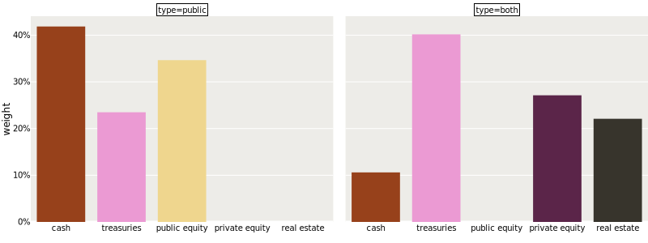
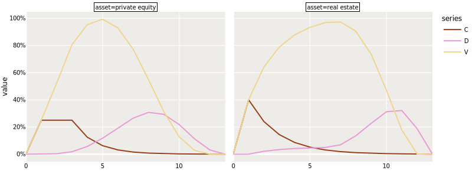
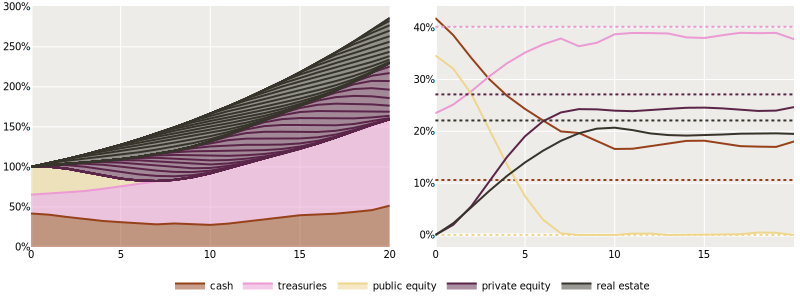
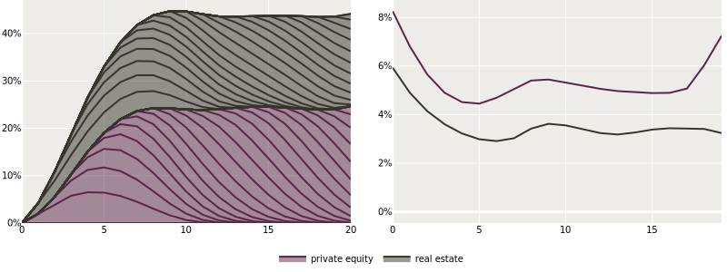
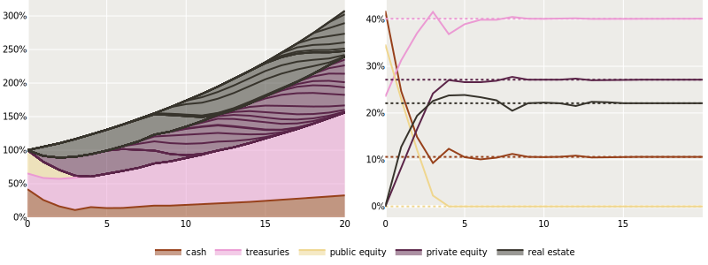
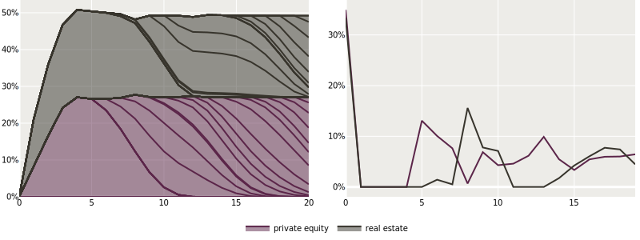
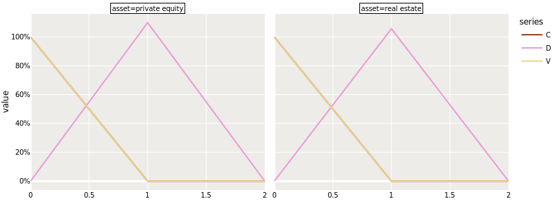
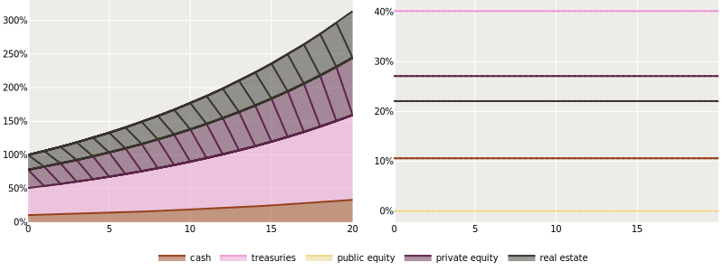

import { Img } from '@/components';

# One does not simply invest in private assets

In this blog post we are going to take the position of an new investor that is building a strategic asset allocation that includes private assets. We will use our asset allocation API to build a 20-year plan that maximizes returns for a given annual risk budget. In the process, we will introduce concepts like commitment pacing, vintage diversification, and liquid sleeves.

The optimization algorithm used in this post is available through our API, and we offer a python notebook that can be used to reproduce results, or run plans with different capital market assumptions.

We assume a basic familiarity with the principles (but not the math) behind mean-variance optimization. The more technical paper behind our optimization algorithm is forthcoming.

# What's so hard?

Investors generally have a solid theoretical understanding of how to build strategic asset allocation with public assets only. However, this is not so when private assets are part of the mix. Markowitz portfolio optimization assumes that investors can invest according to a weight vector. But as practitioners know all too well, one does not simply invest in private assets. As limited partners (LPs), investors can commit to a private fund, giving the general partner (GP) of the fund the bandwidth to invest at a later stage, based on the deals that become available over time. The minimal investment required is also often substantial, and the total duration of the fund's life can easily reach 12 or 15 years.

This makes strategic asset allocation more complicated. The illiquidity demands long term planning of commitments, and the high minimal investment generate diversification constraints. In this blog post, we start with a mean-variance optimization to get a benchmark, and compare this to our approach. We then one-by-one remove **features** from our approach to get back to the benchmark, and explain the value of each feature in the process.

# The mean-variance benchmark

The starting point is a universe of five assets (or rather asset classes), cash, treasuries, public equity, private equity and (private) real estate. We take the published means, volatilities and correlations from J.P. Morgan (2023 results) as an example. The assumptions (annual mean returns, volatility, and correlations) are displayed here.

| Asset                  | Mean (%) | Vol (%) | C    | TR    | EQ    | PE    | RE    |
| ---------------------- | -------- | ------- | ---- | ----- | ----- | ----- | ----- |
| **C**&nbsp;&nbsp; Cash | 2.40     | 0.00    | 1.00 | 0.00  | 0.00  | 0.00  | 0.00  |
| **TR** Treasuries      | 4.20     | 12.27   | 0.00 | 1.00  | -0.11 | -0.51 | -0.28 |
| **EQ** Public equity   | 7.90     | 16.13   | 0.00 | -0.11 | 1.00  | 0.77  | 0.41  |
| **PE** Private equity  | 9.90     | 19.96   | 0.00 | -0.51 | 0.77  | 1.00  | 0.42  |
| **RE** Real estate     | 5.70     | 10.56   | 0.00 | -0.28 | 0.41  | 0.42  | 1.00  |

The standard mean-variance problem maximizes the mean return subject to a volatility constraint. The (long-only) optimization problem reads,

<aside>
  <p>A common alternative version is to minimize volatility subject to a mean return constraint. We will not consider that variant here.</p>
</aside>

```math
\max_{w\geq0}{w^\top\mu} \quad\mathrm{subject\;to}\quad w^\top\Sigma w\leq\sigma^2,\quad w^\top1\leq1.
```

Here, $w$ is the vector of weights we are trying to optimize, $\mu$ is the expected return vector, $\Sigma$ is the covariance matrix of asset returns, and $\sigma$ is the volatility constraint, also called the risk budget. For a risk-budget of 6\%, i.e. $\sigma=0.06$, the solution to the optimization problem is depicted below, on the left without private assets, and on the right with all assets included. Notable is the zero allocation to public equity on the right. Given the high risk-reward ratio of private equity, and its correlation with public equity encoded in our assumptions, the optimizer chooses not to invest in public equity at all.



# The full-fledged plan

In order to construct a sensible allocation plan with private assets, we need to know additional information about the two private assets (private equity and real estate). Firstly, we need to know something about the speed capital deployment (calls) and distribution back to the LPs. In order words, we need a forecasting model for private asset cashflows. The industry standard model is the Takahashi-Alexander model (Takahashi & Alexander, 2002 [^1]), also called the Yale model. This is a deterministic model projecting the calls, distributions and net asset value (NAV) of a private fund.

The model is governed by three linked equations, one for the amount of capital called, one for the amount distributed, and one for the NAV. These equations are parameterized by the call, distribution and growth rates for each fund age. We take the settings from the original paper of the model for the call and distribution rates. The growth rate is simply the mean return we have assumed for each asset class. The figure below shows the call and distribution rates for private equity and real estate. Note how the settings of real estate encode a slightly faster call, but postponed distribution at year 10 and 11.



The second additional information that we need is the volatility specific to funds of each vintage. If the specific volatility is set to zero, then implicitly we assume that a fund with vintage 2000 has the same return at age 4 as a fund with vintage 2001 has at age 3. While they are exposed to common drivers, private funds are made of a limited number of portfolio companies, and may have tilts to specific sectors. The level that we set the idiosyncratic risk as is determined by the type of investor. For a very large investor that invests in many funds, this number is lower due to diversification effects. We take the perspective of a smaller investor that may only invest in one or two new vintages each year, and set the volatility to 25\% for private equity and 20\% for real estate.

Running the optimizer gives us the projected optimal weights in all public assets at each future time, as well as the commitments to all private assets. These parameters are optimized to maximize the final wealth at year 20, given the annual risk budget across both public and private assets. The left figure below shows the projection of total wealth over time, split out by asset class. Within the private asset classes, the different vintages are separated by lines. On the right, we standardize the holdings into weights per asset class. For convenience, the mean-variance weights have been added with dashed lines. At the start, the weights are equal to the public-only mean-variance weights. After that, the weights pull towards the mean-variance weights, but even after stabalizing the optimization prefers cash at the expense of the riskier assets.



The figure below dives deeper into the private market choices. The left graph shows the standardized allocation to the different asset classes, delineated by vintage. With each area being roughly equal in size, the portfolio appears to be vintage-diversified. The right graph shows the commitments to each private asset by year, as a percentage of the total wealth in the same year. During the ramp up phase, we commit more. Overall the allocations remain relatively stable through time, ensuring vintage diversification.



# Let's break this down

The structure of our optimization alogorithm allows us to gradually remove the complicating assumptions that private assets introduce, and thereby converge to the mean-variance benchmark. We start by removing the vintage specific volatility and setting to zero. Running the same optimization we achieve the new projected holdings and portfolio weights below. Unsurprisingly we again start with the pure-public mean-variance optimum at the start. But interestingly, we now converge neatly to the mean-variance optimimum over time. The lower allocation to private assets that we saw above is thus explained entirely by vintage specific volatility.



With no vintage specific volatility, the benefit of vintage diversification disappears entirely, and we see very concentrated investments into some vintages. Looking at the commitments below, the optimization tries to bulk up on private assets as soon as possible by making very large investments at the start, and then committing nothing until year five.



While this change achieves mean-variance weights in the long run, the short run is still quite far off. We can explain this by looking at the illiquidity of the private assets. In fact, if the Takahasi-Alexander model assumptions are reflective of very liquid funds, then we get mean-variance equivalent weights. A perfectly liquid fund lives for one year (at least in an annually rebalanced setup like ours). At the start of the year all commitments are immediately called, and at the end of the year all proceeds are distributed. Below are the cashflow projections corresponding to the growth rates of the two private asset classes. The calls and NAVs overlap perfectly.



Running the optimization and inspecting the projections below, each vintage only lives for one year and is scaled to achieve the mean-variance optimal weights. On the right, the weights are constant through time and align with the single-period mean-variance weights.



# In practice

This post outlines some of the considerations of building a strategic asset allocation plan. Naturally, not everything goes according to plan. The good news is that we can just re-run the plan starting from whatever situation we find ourselves in. So like in a typical application, we make a projection for 20 years, execute the first year, and then roll forward and plan again for the next 20 years given the prevailing private holdings and capital market assumptions, and so on. Therefore, asset allocation with private assets is not a one-of exercise, but a repeated plan that is adjusted based on realized calls and distributions.

# Final thoughts

Despite its simplicity, our analysis reveals important insights for allocators.

- Investors should not steer towards classical mean-variance allocations, as they are suboptimal and will overallocate to private markets.
- Smaller investors should hold less in private assets compared to larger ones, as they cannot diverisify between funds as efficiently.
- Commitments should be smoothed out over time to ensure an allocation remains diversified between vintages. This is especially important for smaller investors.
- When a portfolio is not in equilibrium, the liquid sleeve should be optimized to be as complementary as possible to the private assets that do exist. When no private assets are held yet, the optimum aligns with the mean-variance optimum excluding private assets.

# What's next

In a follow up post, we will evaluate the performance of allocation strategies and heuristics on simulated data. We will also incorporate ruin probabilities in the optimization, secondary market sales, and other constraints.

[^1]: Takahashi, D., & Alexander, S. (2002). Illiquid alternative asset fund modeling. Journal of Portfolio Management, 28(2), 90-100.
