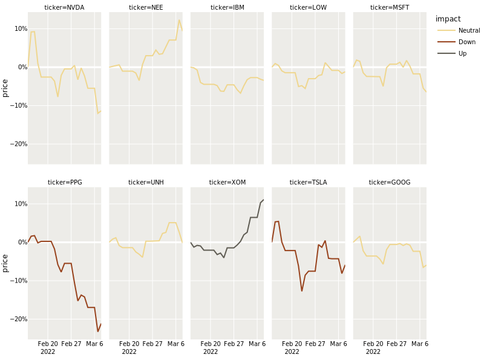

import { Img } from '@/components';

# Introducing ALEX, our AI-Leveraged Exposure calculator

At Bayesline, we are thrilled to announce our latest undertaking to reimage financial analytics: ALEX. ALEX is our **A**I-**L**everaged **Ex**posure calculator. ALEX is named after Alexander, a character from Michael Lewis' Liar's Poker. The following is a passage describing Alexander's reponse to an earthquake that hit Japan:

> First, the stocks of Japanese insurance companies. The world would probably assume that ordinary insurance companies had a great deal of exposure, when in fact, the risk resides mainly with Western insurers and with a special Japanese earthquake insurance company that’s been socking away premium for decades.

Alexander teaches us a few things about exposures.

- Correctly identifying exposures to an event requires deep understanding of individual companies beyond the platitudes of headquarter location, and industry
- Exposure identification requires a combination of qualitative and quantitative reasoning
- Smart money gets insight into exposures fast, and eats everyone else's lunch

Alexander did not operate in an age where AI agents are getting increasingly more competent. But we do. Yet calculating exposures to this day is a highly manual process. It either involves a team of analysts who sift through corporate filings, databases and reports to figure out exposures to events or new themes that markets may be crowding into. Investors may have their own teams of analysts, or they may use sell-side baskets. If a time-series of data is available the running linear regressions is a potential approach, albeit backward looking and noisy.

Once exposures have been determined, they are extremely hard to integrate with downstream analytics. Off-the-shelf factor risk models are inflexible, and only the most sophisticated hedge funds have the infrastructure in place to quickly add a factor and evaluate its properties.

We want to help our clients with both problems. We have a high-perfomance risk engine in place that can estimate risk models from user/vendor-provided exposures in seconds, giving investors full control over the settings and factors in the model. But for investors that want to go beyond using simple sell-side baskets or linear regression-based exposures, we also want to offer a systematic way to come up with exposure to any event that requires attention. This is why we are building ALEX.

# AI-leveraged exposures

As an (very preliminary) exploratory example, we will try to get a directional sense for the impact of an event on stock prices. Generally events can fall into one of the following categories:

- Marcoeconomic events, such as rate cuts or inflation
- Regulatory changes
- Geopolitical events
- Price changes of good or services
- Supply chain disruptions, such as bankruptcies or natural disasters

In this post, we will be trying out the following events. The description of these events is limited to a short sentence. Not all events are supposed to have an impact on financial markets.

1. Russia invades Ukraine
2. The price of oil increases
3. There is a cut in interest rates after a period of high interest rates
4. Inflation in the US is higher than expected
5. Biden's dog dies

While more powerful LLMs are available, we use OpenAI's GPT-4.0 here. The reason is that this model is trained using data up to September 2021, and therefore has no knowledge of Ukraine's invasion. This helps us better understand how LLMs can reason through hypothetical situations. Indeed, if we ask when Russia last invaded Ukraine, our LLM replies:
Russia last invaded Ukraine in 2014.

# Russia invades Ukraine - Event explanations

We first ask our AI agent (or rather, a network of agents that collectively solve a problem), to give a high-level analysis of the event.

> The high-level analysis is that this event would have a broad and significant impact on global financial markets. The uncertainty and geopolitical tensions would likely lead to increased market volatility, with investors moving away from riskier assets and towards safe havens. The disruption to energy supplies would likely lead to higher energy prices, impacting a wide range of industries and countries. The sanctions against Russia would also disrupt trade and financial flows, impacting any industries and countries that have significant dealings with Russia.
>
>  
>  
> 1. **Energy Industry**: The conflict would disrupt the supply of oil and gas from Russia, leading to higher energy
> prices. This would impact energy-intensive industries and countries that rely on Russian energy supplies.
>
> 2. **Financial Services**: The sanctions against Russia would disrupt financial flows, impacting banks and other financial institutions that have dealings with Russia.
> 3. **Manufacturing**: The higher energy prices would increase production costs for manufacturers, potentially leading to higher prices for manufactured goods.
> 4. **Agriculture**: Ukraine is a major exporter of grain, so the conflict could disrupt grain supplies, leading to higher food prices.
> 5. **Countries**: The impact would be felt most strongly in countries that rely heavily on Russian energy supplies, such as many European countries, and countries that have significant trade or financial dealings with Russia.
>
> For each of these industries and countries, the impact would likely be negative, with higher costs and prices, and potential disruptions to supply chains.

In our application, we can guide the LLM by giving it more context and rerunning the explanation with this context. For example, we might want to explain the use of neon gas in semiconductor production (something that more recent LLMs do off-the-cuff). In this example, we have only used the first response, and are deliberately vague in some of the events.

The analyses of all other events are provided at the bottom of this article.

# Russia invades Ukraine - Event impact summary

We let our network of agents analyze the impact of the event of a set of stocks. For now we want ALEX to predict the direction of the stock move, and explain its reasoning. We don't expect ALEX to meet the quality of a thorough analysis by a financial analyst, but ALEX will surely be faster, and can serve as an input such a more elaborate analysis.

The chart below shows a summary of the companies we analyzed in this study and their stock prices around the time of the Russia Ukraine invasion, colored by the impact ALEX suggested.
The next section will give the reasoning for each company and its suggested impact.

We can see that ALEX makes mostly sensible choices here.
These answers are not based on its pre-learned knowledge of each company.
Rather, ALEX queries the 10-K filings of each company to learn about its business, and compares the results to its own analysis of the impact of the event.
If we look at the prices post Feb 14 (the invasion date), we see that ALEX was directionally correct about PPG, Exxon and Tesla.
This is obviously a very crude analysis that omits the effect of any other factors and idiosyncratic news on individual tickers,
but it does give us confidence that with the right input data, ALEX can become a powerful aid to fundamental managers.

If you are interested in ALEX and would like to learn more, please reach out by [email](mailto:founders@bayesline.com) or [schedule a meeting directly](http://schedule30.bayesline.com).

# Russia invades Ukraine - Event impact reasoning

#### NEE - NextEra Energy

**Impact: Neutral**

> The company's primary industry classification is Electric Power and Energy Infrastructure, with significant operations in renewable energy through its subsidiaries FPL and NEER. While the event of Russia invading Ukraine has a substantial impact on the energy industry, particularly in terms of higher energy prices and disruptions to energy supplies, NextEra Energy's focus on renewable energy sources like wind and solar mitigates its exposure to fossil fuel price volatility. Additionally, the company's primary operations and sourcing are in the United States and Canada, which are less directly impacted by the geopolitical tensions and sanctions against Russia. Therefore, the event's impact on NextEra Energy's stock price is likely to be neutral relative to the market.

---

#### LOW - Lowe's

**Impact: Neutral**

> The event of Russia invading Ukraine primarily impacts industries such as energy, financial services, manufacturing, and agriculture. The Home Improvement Retail Industry, which is the classification of the company, is not directly impacted by the event. While there may be some indirect effects such as increased energy costs affecting operational expenses, these impacts are not significant enough to cause a notable deviation in the company's stock price relative to the market. Additionally, the company's primary operations and sales are in the United States and India, which are not among the most directly impacted countries. Therefore, the stock price impact is neutral.

---

#### PPG - PPG Industries

**Impact: Down**

> The event of Russia invading Ukraine has significant implications for the energy and manufacturing industries, both of which are relevant to the company. The disruption in energy supplies from Russia is likely to lead to higher energy prices, which would increase production costs for the company, given that raw materials and energy are significant inputs. Additionally, the geopolitical instability and sanctions could disrupt supply chains and financial flows, particularly in Europe, where the company has substantial operations and sales. The increased costs and potential supply chain disruptions would likely negatively impact the company's profitability, leading to a downward pressure on its stock price relative to the market.

---

#### IBM - IBM

**Impact: Neutral**

> The event of Russia invading Ukraine primarily impacts the energy, financial services, manufacturing, and agriculture industries, as well as countries heavily reliant on Russian energy supplies and those with significant trade or financial dealings with Russia. IBM, classified under Information Technology Services, does not fall directly within these impacted industries. Additionally, while IBM has global operations and sources from various countries, its primary revenue streams from cloud services, software solutions, and hardware products are not directly affected by the disruptions in energy supply, financial flows, or agricultural exports. Therefore, the impact on IBM's stock price relative to the market is neutral.|

---

#### XOM - Exxon Mobil

**Impact: Up**

> The event of Russia invading Ukraine is expected to disrupt the supply of oil and gas from Russia, leading to higher energy prices globally. As ExxonMobil operates in the Oil and Gas Industry, this increase in energy prices would likely benefit the company by increasing its revenue from crude oil, natural gas, and refined petroleum products, which together constitute 85% of its total revenue. Additionally, the geopolitical tensions and sanctions against Russia would likely reduce competition in the global energy market, further benefiting ExxonMobil. Therefore, the stock price of ExxonMobil is expected to go up relative to the market as a result of this event.|

---

#### UNH - UnitedHealth

**Impact: Neutral**

> The event of Russia invading Ukraine primarily impacts industries such as energy, financial services, manufacturing, and agriculture. UnitedHealth Group operates within the healthcare services industry, which is not directly impacted by the event. The company's primary inputs, such as medical costs and operating costs, are not significantly affected by the geopolitical tensions or disruptions in energy supplies. Additionally, the company's operations and revenue sources are primarily based in the United States and other countries in the Americas, which are not the primary regions affected by the conflict. Therefore, the stock price impact for UnitedHealth Group relative to the market is neutral.|

---

#### UNH - UnitedHealth

**Impact: Neutral**

> The event of Russia invading Ukraine primarily impacts industries such as energy, financial services, manufacturing, and agriculture. UnitedHealth Group operates within the healthcare services industry, which is not directly impacted by the event. The company's primary inputs, such as medical costs and operating costs, are not significantly affected by the geopolitical tensions or disruptions in energy supplies. Additionally, the company's operations and revenue sources are primarily based in the United States and other countries in the Americas, which are not the primary regions affected by the conflict. Therefore, the stock price impact for UnitedHealth Group relative to the market is neutral.|

---

#### GOOG - Alpahet

**Impact: Neutral**

> The event of Russia invading Ukraine primarily impacts industries such as energy, financial services, manufacturing, and agriculture. The company's industry classification is Technology - Internet Services and AI Platform, which is not directly impacted by the event. While there may be some indirect effects due to increased market volatility and potential disruptions in global financial markets, the company's core business operations, revenue streams, and production inputs are not significantly tied to the impacted industries or countries. Therefore, the stock price impact relative to the market is neutral.|

---

#### MSFT - Microsoft

**Impact: Neutral**

> The event of Russia invading Ukraine primarily impacts industries such as energy, financial services, manufacturing, and agriculture. Microsoft's industry classification is Technology Services and Solutions, which is not directly impacted by the event. While there may be some indirect effects due to increased market volatility and potential disruptions in global financial markets, these impacts are not specific to Microsoft's core business operations. Additionally, Microsoft's key inputs, such as employee compensation, cloud-based services, and research and development, are not directly tied to the affected industries or countries. Therefore, the stock price impact for Microsoft relative to the market is neutral.|

---

#### TSLA - Tesla

**Impact: Down**

> The company's primary industry classifications are Automotive and Energy Generation and Storage, both of which are significantly impacted by the event. The invasion of Ukraine by Russia is expected to lead to higher energy prices due to disruptions in the supply of oil and gas from Russia. This will increase production costs for the company's automotive manufacturing and energy storage products, which are energy-intensive. Additionally, the geopolitical instability and market volatility could negatively affect consumer confidence and spending, potentially reducing demand for high-ticket items like electric vehicles. The company's significant operations and sales in Europe, which is heavily reliant on Russian energy supplies, further exacerbate the negative impact. Therefore, the overall effect of the event on the company's stock price is expected to be negative relative to the market.|

---

#### NVDA - Nvidia

**Impact: Neutral**

> The event of Russia invading Ukraine primarily impacts industries such as energy, financial services, manufacturing, and agriculture. NVIDIA, being in the Technology - Semiconductor & Computing industry, is not directly impacted by these sectors. While there may be some indirect effects such as increased energy costs or market volatility, these are not significant enough to directly affect NVIDIA's core business operations or revenue streams. Additionally, NVIDIA's key sourcing and selling countries (e.g., Taiwan, South Korea, China, Japan, the United States) are not directly involved in the conflict. Therefore, the overall impact on NVIDIA's stock price relative to the market is neutral.|

---

# Some more events

We list the preliminary output of ALEX below across all events. It is clear that ALEX makes some odd choices here and there, but overall yield promising results to build on.

| Event                            | Company        | Impact  |
| -------------------------------- | -------------- | ------- |
| Russia invades Ukraine           | NextEra Energy | Neutral |
|                                  | Lowe's         | Neutral |
|                                  | PPG Industries | Down    |
|                                  | IBM            | Neutral |
|                                  | Exxon Mobil    | Up      |
|                                  | UnitedHealth   | Neutral |
|                                  | Alpahet        | Neutral |
|                                  | Microsoft      | Neutral |
|                                  | Tesla          | Down    |
|                                  | Nvidia         | Neutral |
| The price of oil increases       | NextEra Energy | Neutral |
|                                  | Lowe's         | Down    |
|                                  | PPG Industries | Down    |
|                                  | IBM            | Neutral |
|                                  | Exxon Mobil    | Up      |
|                                  | UnitedHealth   | Neutral |
|                                  | Alpahet        | Neutral |
|                                  | Microsoft      | Neutral |
|                                  | Tesla          | Down    |
|                                  | Nvidia         | Neutral |
| There is a cut in interest rates | NextEra Energy | Up      |
|                                  | Lowe's         | Up      |
|                                  | PPG Industries | Up      |
|                                  | IBM            | Up      |
|                                  | Exxon Mobil    | Neutral |
|                                  | UnitedHealth   | Neutral |
|                                  | Alpahet        | Up      |
|                                  | Microsoft      | Up      |
|                                  | Tesla          | Up      |
|                                  | Nvidia         | Up      |
| Inflation in the US is higher    | NextEra Energy | Neutral |
|                                  | Lowe's         | Down    |
|                                  | PPG Industries | Down    |
|                                  | IBM            | Neutral |
|                                  | Exxon Mobil    | Neutral |
|                                  | UnitedHealth   | Neutral |
|                                  | Alpahet        | Neutral |
|                                  | Microsoft      | Neutral |
|                                  | Tesla          | Down    |
|                                  | Nvidia         | Neutral |
| Biden's dog dies                 | NextEra Energy | Neutral |
|                                  | Lowe's         | Neutral |
|                                  | PPG Industries | Neutral |
|                                  | IBM            | Neutral |
|                                  | Exxon Mobil    | Neutral |
|                                  | UnitedHealth   | Neutral |
|                                  | Alpahet        | Neutral |
|                                  | Microsoft      | Neutral |
|                                  | Tesla          | Neutral |
|                                  | Nvidia         | Neutral |

# Event explanations

The following sections contain the analysis of the other events. All output is AI-generated.

### The price of oil increases

The impact of an increase in oil prices is broad and can affect many industries and countries. Countries that are heavily reliant on oil for their energy needs or for their industrial production will be particularly affected. The impact can also be felt in financial markets as higher oil prices can lead to increased inflation, which can in turn affect interest rates and the value of currencies.

1. Transportation industry: Higher oil prices increase the cost of fuel, which can lead to higher transportation costs and potentially lower demand for transportation services.
2. Manufacturing industry: Higher oil prices can increase the cost of production, which can lead to a decrease in supply and potentially higher prices for manufactured goods.
3. Countries heavily reliant on oil: Countries such as the US, China, and India, which are heavily reliant on oil for their energy needs, can see increased energy costs and potentially lower economic growth.
4. Consumer goods and services: Higher oil prices can decrease disposable income for consumers, which can lead to lower demand for consumer goods and services.
5. Financial markets: Higher oil prices can lead to increased inflation, which can affect interest rates and the value of currencies. This can impact the stock market, bond market, and forex market.

### There is a cut in interest rates after a period of high interest rates

The impact on financial markets can be broad and significant. Lower interest rates can lead to a surge in stock markets as businesses are expected to perform better due to increased investment and consumer spending. However, bond markets may suffer as lower interest rates mean lower returns for bondholders. The impact can be felt across many industries and countries, especially those with high levels of debt, as the cost of servicing this debt decreases.

1. Banking and Financial Services: Lower interest rates mean lower profit margins for banks on their lending activities. However, increased borrowing can offset this to some extent.
2. Real Estate: Lower interest rates can stimulate the real estate market as mortgages become cheaper, leading to increased demand for housing.
3. Retail: Increased consumer spending can benefit the retail industry.
4. Countries with high levels of debt: These countries can benefit as the cost of servicing their debt decreases.
5. Savers and Pension Funds: These groups may suffer as the returns on their savings or investments decrease.
6. Goods and Services: There can be increased demand for goods and services as consumer spending increases. However, if the supply of these goods and services cannot keep up with the increased demand, this could lead to inflation.

### Inflation in the US is higher than expected

Higher than expected inflation can lead to uncertainty in the financial markets. Investors may become wary of the future economic outlook and this can lead to a decrease in investment. This can impact the supply of goods and services as businesses may cut back on production due to the decrease in investment. On the demand side, consumers may also cut back on spending as their purchasing power decreases due to the rising prices. This can lead to a decrease in demand for goods and services. The impact of higher than expected inflation can be broad and affect many industries and countries, especially those that are closely tied to the US economy.

1. Financial Services Industry: Higher inflation can lead to higher interest rates, which can impact the profitability of banks and other financial institutions.
2. Retail Industry: As consumers cut back on spending, retailers may see a decrease in sales.
3. Manufacturing Industry: As businesses cut back on production, manufacturers may see a decrease in orders.
4. Countries: Countries that are closely tied to the US economy, such as Canada and Mexico, may also be impacted by the higher than expected inflation in the US.
5. Goods and Services: The demand for non-essential goods and services may decrease as consumers cut back on spending. On the supply side, the production of goods and services may decrease as businesses cut back on production.

For each of these impacts, the reasoning is that higher than expected inflation can lead to uncertainty in the financial markets, which can lead to a decrease in investment and consumer spending. This can impact the demand and supply of goods and services.

### Biden's dog dies

The impact of Biden's dog's death is likely to be confined to the emotional well-being of the Biden family and those close to them. While it may not have a direct impact on financial markets or industries, it could potentially influence public sentiment towards the President and his administration. This event is more personal in nature and may not have widespread economic implications.

- Industries: None
- Countries: None
- Goods and Services: None

If you are interested in ALEX and would like to learn more, please reach out by [email](mailto:founders@bayesline.com) or [schedule a meeting directly](http://schedule30.bayesline.com).
